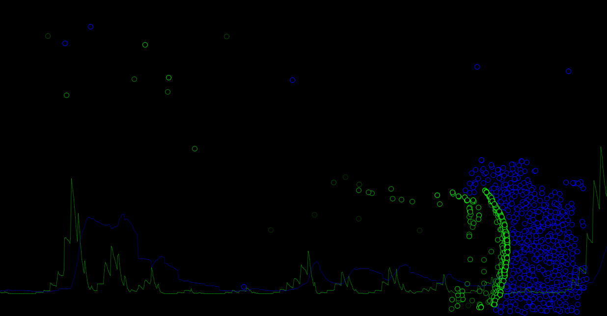

# Predator and Prey

## Description
Simulation &amp; visualization of predator and prey behaviour written in [Processing](https://processing.org).



## Requirements
[Processing](https://processing.org) is required to run the program.

## Quick start
### Windows
*(may work on Linux too but wasn't tested)*
```console
$ processing-java --sketch=path/to/battle --run
```
**Note:** `path/to/battle` is a path to the directory containing `battle.pde`.
